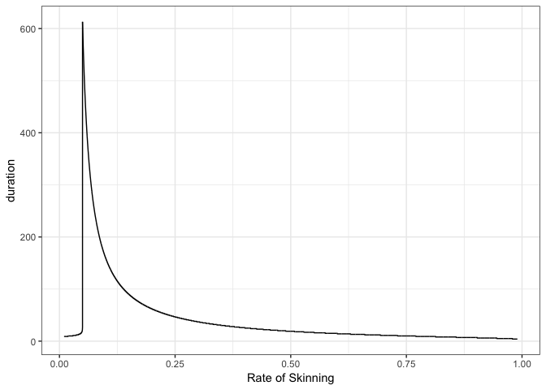

Cats and Rats
================
Michael Mann
4/17/2019

``` r
library(knitr)
```

    ## Warning: package 'knitr' was built under R version 3.4.4

``` r
opts_chunk$set(tidy.opts=list(width.cutoff=60),tidy=TRUE)
```

The order of events will be: 1. Cats and rats will reproduce
2. Cats will be fed the rats
3. The cats will be skinned
4. Repeat for a year unless the cats or rats populations reach zero

This first block will assume 5000 cats are skinned a day

``` r
library(tidyverse)  #load this package for plotting and manipulating data
total_days <- 3650  # going to simluate the model for 10 decades

# pre-allocate vectors
C <- rep(NA, total_days)  #Vector of number of cats
R <- rep(NA, total_days)  #Vector of number of rats
D <- rep(NA, total_days)  #Vector of number of skinned cats

# initial population size
C[1] <- 1e+05  #initial cat population size
R[1] <- 1e+06  #initial rat population size
D[1] <- 0  #initial skinned cat population size

# loop to run the model
for (t in 1:total_days) {
    if (C[t] < 0 | R[t] < 0) 
        {
            break
        }  #stop the loop if either population is below zero.
    
    
    #### Births #####
    C[t + 1] <- C[t] + (12/365) * C[t]  # Cats
    R[t + 1] <- R[t] + (144/365) * R[t]  # Rats
    
    ### Feeding #####
    
    R[t + 1] <- R[t + 1] - 4 * C[t + 1]  # feed the cats
    
    # skin the cats
    D[t + 1] <- D[t] + 5000  #add 5000 cats to skinned vector
    C[t + 1] <- C[t + 1] - 5000  #remove 5000 cats to skinned vector
}

# output the results in a dataframe time in days, cats vector
# number of skinned cats
model_output <- data.frame(time = 1:total_days, Cats = C, Rats = R, 
    Skinned_Cats = D) %>% # remove days that were not used since the model stopped
na.omit()
print(paste("population crash at", t, "days"))
```

    ## [1] "population crash at 35 days"

Here is the full plot where you can see the rats run amock

``` r
model_output %>% # change from wide form to long form
gather(key = "Variables", value = "Individuals", -time) %>% ggplot(aes(x = time, 
    y = Individuals, color = Variables)) + geom_line() + theme_bw() + 
    # reformat y axis
scale_y_continuous(labels = function(x) format(x, big.mark = ",", 
    scientific = F)) + # add xlabel
xlab("Days")
```


We can limit the y axis so we can see the cat population dwindle to zero.

``` r
model_output %>% # change from wide form to long form
gather(key = "Variables", value = "Individuals", -time) %>% ggplot(aes(x = time, 
    y = Individuals, color = Variables)) + geom_line() + theme_bw() + 
    # reformat y axis
scale_y_continuous(labels = function(x) format(x, big.mark = ",", 
    scientific = F), limits = c(0, 1e+06)) + # add xlabel
xlab("Days")
```


The model outputs reveal that rat population did just fine but cat population was decimated by the 5000 cats being skinned each day. After 35 days, the population crashed, thus skinning 5000 cats a day too much and needs to be scaled back. What if we scale it back to only 1000 skinned cats a day?

runnign the code exactly the same but now number of cats skinned per day is reduced to 1000.

``` r
# going to simluate the model for 365 days
total_days <- 3650

# pre-allocate vectors
C <- rep(NA, total_days)
R <- rep(NA, total_days)
D <- rep(NA, total_days)

# initial population size
C[1] <- 1e+05
R[1] <- 1e+06
D[1] <- 0

# loop to run the model
for (t in 1:total_days) {
    if (C[t] <= 1 | R[t] <= 1) 
        {
            break
        }  #stop the loop if either population is below zero.
    
    
    ##### Births ###### Cats
    C[t + 1] <- C[t] + (12/365) * C[t]
    
    # Rats
    R[t + 1] <- R[t] + (144/365) * R[t]
    
    
    ### Feeding ##### feed the cats
    R[t + 1] <- R[t + 1] - 4 * C[t + 1]
    
    # skin the cats now only doing 1000 a day
    D[t + 1] <- D[t] + 1000
    C[t + 1] <- C[t + 1] - 1000
}

model_output <- data.frame(time = 1:total_days, Cats = C, Rats = R, 
    Skinned_Cats = D) %>% na.omit()
print(paste("population crash at", t, "days"))
```

    ## [1] "population crash at 9 days"

Plot with the population sizes for the cats, rats, and number of skinned cats. Now the rat population crashes.

``` r
model_output %>% gather(key = "Variables", value = "Individuals", 
    -time) %>% ggplot(aes(x = time, y = Individuals, color = Variables)) + 
    geom_line() + theme_bw() + # reformat y axis
scale_y_continuous(labels = function(x) format(x, big.mark = ",", 
    scientific = FALSE)) + # change x axis
xlab("Days")
```


Let's rerun it but look for the optimal rate to skin the cats. I built a loop outside of it and will iterate the model with different rates of the cats being skinned per day. I will save the results of each model in the output dataframe.

``` r
num_skinned <- seq(0.01, 0.99, by = 1e-04)

output <- data.frame(num_skinned, duration = rep(NA, length(num_skinned)), 
    profit = rep(NA, length(num_skinned)))

for (i in 1:length(num_skinned)) {
    
    total_days <- 3650  # going to simluate the model for 365 days
    
    # pre-allocate vectors
    C <- rep(NA, total_days)
    R <- rep(NA, total_days)
    D <- rep(NA, total_days)
    
    # initial population size
    C[1] <- 1e+05
    R[1] <- 1e+06
    D[1] <- 0
    
    # loop to run the model
    for (t in 1:total_days) {
        if (C[t] <= 1 | R[t] <= 1) 
            {
                break
            }  #stop the loop if either population is below zero.
        
        
        ##### Births ###### Cats
        C[t + 1] <- C[t] + (12/365) * C[t]
        
        # Rats
        R[t + 1] <- R[t] + (144/365) * R[t]
        
        
        ### Feeding ##### feed the cats
        R[t + 1] <- R[t + 1] - 4 * C[t + 1]
        
        # skin the cats now only doing 1000 a day
        D[t + 1] <- D[t] + num_skinned[i] * C[t + 1]
        C[t + 1] <- C[t + 1] - num_skinned[i] * C[t + 1]
    }
    
    output[i, 2] <- t
    output[i, 3] <- D[t] * 0.3
}
print(paste("population crash at", t, "days"))
```

    ## [1] "population crash at 4 days"

Plot of rate of skinning cats per day and the number of days the simulation could last before the cat or rat population crashed

``` r
output %>% ggplot(aes(x = num_skinned, y = duration)) + geom_line() + 
    theme_bw() + # reformat y axis
scale_y_continuous(labels = function(x) format(x, big.mark = ",", 
    scientific = FALSE)) + xlab("Rate of Skinning")
```



Plot of rate of skinning cats per day and the cumulative profit.

``` r
output %>% ggplot(aes(x = num_skinned, y = profit)) + geom_line() + 
    theme_bw() + # reformat y axis
scale_y_continuous(labels = scales::dollar) + xlab("Rate of Skinning")
```


most profitable rate is 0.0499

``` r
output %>% arrange(desc(profit)) %>% head()
```

    ##   num_skinned duration   profit
    ## 1      0.0499      613 82844.77
    ## 2      0.0500      609 82553.92
    ## 3      0.0501      606 82266.27
    ## 4      0.0502      603 81981.75
    ## 5      0.0503      599 81700.30
    ## 6      0.0504      596 81421.89
